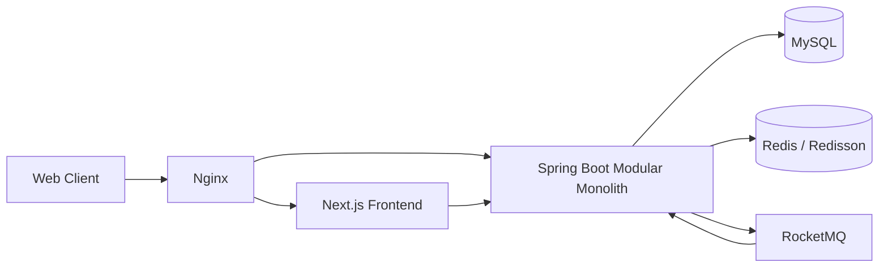

# XTicket

## 项目简介

XTicket 是面向固定座位活动的 C 端综合票务交易与履约服务，覆盖锁座、建单、模拟支付、电子票、核销与退款完整链路。后端采用 Spring Boot Maven 多模块单体，前端采用 Next.js；项目重点解决并发锁座、防超卖、交易一致性、可靠事件发布和可复现性能验证。

## 技术栈

| 领域 | 技术 |
| --- | --- |
| 后端 | Java 17、Spring Boot 3.2、MyBatis / MyBatis-Plus、Maven 多模块 |
| 数据与并发 | MySQL 8、Redis 7、Redisson、Caffeine |
| 消息 | RocketMQ 5、Transactional Outbox |
| 前端 | Next.js 14、React 18、TypeScript、Tailwind CSS、Zustand、Axios |
| 网关与运行 | Nginx、Docker Compose |
| 可观测性 | Spring Boot Actuator、Micrometer、traceId |

## 系统架构



项目是模块化单体，不包含注册中心、配置中心、独立 API Gateway、Redis Cluster 或 MySQL 主从架构。

## 核心业务

```text
浏览活动与场次
  → 查询固定座位图
  → 锁定座位并获得 lockToken
  → 创建待支付订单
  → MOCK_POINTS 积分支付
  → 幂等签发电子票
  → 入场核销，或退款并使电子票失效、释放座位与库存
```

- **锁座**：校验座位请求，以细粒度 seat / seat-set 分布式锁保护同座竞争。
- **建单**：校验锁座归属和 lockToken，写入订单快照并扣减 Redis、MySQL 库存。
- **支付与出票**：订单状态 CAS、积分条件扣减、支付流水和电子票在本地事务中落库。
- **核销**：电子票 `ISSUED → USED` 条件更新，重复核销幂等返回。
- **退款**：已支付订单退款后返还积分、恢复库存，使电子票 `ISSUED → INVALIDATED`，座位可再次销售。

## 核心设计

### 高并发锁座与防超卖

- 使用确定性排序的 seat / seat-set Redisson 锁，提高同场次不同座位的并发度并规避多座位锁顺序死锁。
- Redis Lua 原子检查并预扣场次库存，失败时执行补偿或记录待对账标记。
- MySQL 使用带库存下限条件的原子扣减，防止 lost update 和库存变负。
- `seat_lock`、`order_seat` 等唯一约束作为重复售座的最终数据库兜底。
- 超时关单和取消流程释放仍有效的锁座，并恢复数据库及 Redis 库存。

### 交易一致性

- 建单、支付、退款和核销以 MySQL 本地事务与状态 CAS 保证关键状态转换。
- 订单保存活动、场馆、场次、座位和价格快照，避免基础信息变化污染历史订单。
- 支付记录保留成功事实；退款使用独立退款记录，不覆盖支付历史。
- 电子票状态机为 `ISSUED / USED / INVALIDATED`，退款与核销并发最终由数据库条件更新约束。

### Transactional Outbox

业务数据和领域事件在同一个本地事务中写入 MySQL。后台 publisher 通过 CAS claim 获取事件，以固定有界并发发送到 RocketMQ，成功后标记 `PUBLISHED`；失败事件保留稳定 eventId 并按既有退避语义重试，超时的 `PROCESSING` 事件可恢复。消费者通过 `(consumer_group, event_id)` 唯一键实现幂等。

该链路采用 **at-least-once delivery + idempotent consumer**。

### 电子票履约

- 支付成功后按已售座位幂等签发电子票。
- 工作人员核销接口仅允许 `CHECKIN_STAFF` 等授权角色访问。
- 首次核销执行 `ISSUED → USED`；重复请求不会重复产生副作用。
- 已核销票拒绝退款；退款成功将未使用票置为 `INVALIDATED`，失效票不能核销。

## 性能优化

| 场景 | 本地可复现结果 |
| --- | --- |
| 20,000 座位 Seat Layout | P95 `923.329 ms → 35.739 ms` |
| Payment `seat_lock` UPDATE | P95 `117.408 ms → 1.688 ms` |
| Full Transaction | TPS 中位数 `93.233` |
| Full Transaction | P95 `513 ms`，P99 `661.03 ms` |
| 正确性 Gate | `0` 超卖、`0` timeout、`0` deadlock |
| Outbox Gate | Formal 三轮在 120 秒检查点 backlog 均为 `0` |

Full Transaction 正式测试采用 25 VU、30 秒 warmup、60 秒 measurement，并使用三轮中位数。以上数据均来自固定本地环境中的可复现 Benchmark，用于版本间优化对比，**不代表生产容量或 SLA**。

详细证据：

- [20k 座位图紧凑协议](scripts/benchmark/results/seat-layout-compact-summary.md)
- [`seat_lock.order_no` 索引实验](scripts/benchmark/results/payment-seat-lock-order-index-summary.md)
- [Outbox 有界并发实验](scripts/benchmark/results/outbox-bounded-concurrency-summary.md)

## Benchmark

[`scripts/benchmark/`](scripts/benchmark/) 提供固定 fixture、warmup/measurement 分离、k6 workload、服务端指标采样、MySQL 锁等待采样、三轮中位数和正确性/Outbox Gate。原始 k6、metrics、MySQL 与 Docker 输出保存在被忽略的运行目录中，仓库仅保留少量最终 Markdown 摘要。

需要 Docker 服务、Windows PowerShell 5.1 和 k6。先执行 Quick，只有 Quick PASS 后才能执行 Formal：

```powershell
powershell.exe -NoProfile -ExecutionPolicy Bypass -File .\scripts\benchmark\run-phase6c-8.ps1 -Mode Quick
powershell.exe -NoProfile -ExecutionPolicy Bypass -File .\scripts\benchmark\run-phase6c-8.ps1 -Mode Formal
```

更多 fixture、场景和指标口径见 [Benchmark README](scripts/benchmark/README.md)。

## 快速开始

### 环境要求

- JDK 17
- Node.js 18.17+ 与 npm
- Docker Desktop / Docker Compose
- Windows PowerShell 5.1（运行现有验收及 Benchmark 脚本时）

### Docker 全栈启动

复制公开配置模板，并为本地环境设置真实密码和 JWT secret：

```powershell
Copy-Item .env.example .env
cd backend
.\mvnw.cmd -q clean package
cd ..
docker compose up -d --build
```

MySQL 初始化 DDL 由 `docker/mysql/init/` 自动挂载执行。确认后端健康状态：

```powershell
docker compose exec -T backend wget -qO- http://127.0.0.1:8080/actuator/health
```

Nginx 默认入口为 `http://localhost`。

### 分别启动后端与前端

后端默认使用 H2 内存数据库，适合本地浏览基础功能：

```powershell
cd backend
.\mvnw.cmd -q clean package
.\mvnw.cmd -f provider\pom.xml spring-boot:run
```

H2 也用于部分自动化测试，但不是完整交易演示环境；体验 Redis/Redisson 锁座、RocketMQ 和 Transactional Outbox 时请使用 Docker Compose。

另一个终端启动前端：

```powershell
cd frontend
npm ci
npm run dev
```

前端开发地址为 `http://localhost:3000`，API 由 Next.js rewrites 转发到 `http://localhost:8080`。

## 项目结构

```text
backend/
  common/       公共常量、JWT、可观测性上下文
  domain/       DTO、VO、PO、事件与状态枚举
  dao/          MyBatis / MyBatis-Plus 数据访问
  service/      交易、履约、缓存、锁、Outbox 与 MQ 消费
  biz/          业务编排
  provider/     Controller、应用入口和运行配置
frontend/       Next.js C 端页面
docker/         MySQL、Nginx、RocketMQ 配置
scripts/        API 验收和可复现 Benchmark
  benchmark/    固定 fixture、负载场景、采集器与公开摘要
  migration/    已有数据升级脚本
```

## 项目边界

- 支付方式为 `MOCK_POINTS` 积分模拟支付，未接入真实第三方支付、支付回调或退款渠道。
- 当前形态是 Spring Boot Maven 多模块单体，不包含服务拆分与分布式治理组件。
- Benchmark 在 client/server 同机的本地 Docker 环境运行，只用于回归和优化前后对比。
- 项目未声明生产级容量、可用性或 SLA。

## Development Notice

本项目在已有学习项目基础上，经原开发者授权进行公开二次开发与工程化重构。当前版本主要完成了固定座位活动领域迁移、细粒度并发锁座、库存一致性、电子票/核销/退款履约、Transactional Outbox、运行时可观测性、可复现 Benchmark 与针对性性能优化。仓库中未确认可公开引用的原项目 URL，因此不编造来源链接；授权证据由维护者线下保存。

## License

This repository is published for learning, portfolio and interview demonstration. No project-level open-source license is granted by this repository.
